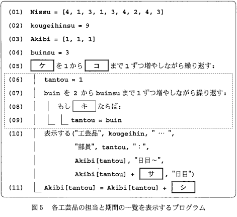
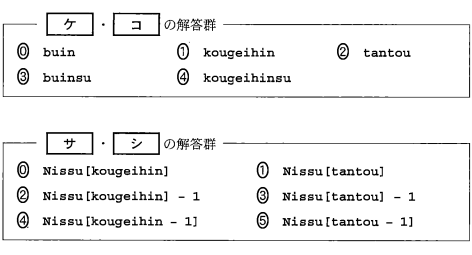

# ⚡️Lightning Talk⚡️

## N Code Labo LT 大会 2025 年 3 月

---

# 自己紹介 💁‍♂️

名前：鎌田 一輝（かまた かずき）
所属：N Code Labo 横浜教室

とくいなこと：うぇぶあぷりのかいはつ
よく使う技術：Angular(TypeScript), Django(Python)

大学入試センター試験の受験回数：2 回

---

# 今、一番アツいプログラミング言語って？🤔

---

# Python? Java? TypeScript? Go? ...

---

# <!-- fit -->DNCL

---

# DNCL って何？✍️

- 共通テスト手順記述標準言語
- **D**aigaku **N**yushi **C**enter **L**anguage
- 共通テスト「情報 I」のプログラミング系の問題で使用される
- 1 系と 2 系がある
  - 1 系：VBA などに似ている。おそらく滅びた。
  - 2 系：Python などに似ている。今後こちらが使われそう。

---

# 参考: DNCL（1 系）📖

大学入試センターから [仕様書](https://www.dnc.ac.jp/albums/abm.php?d=67&f=abm00000819.pdf&n=R4_%E5%85%B1%E9%80%9A%E3%83%86%E3%82%B9%E3%83%88%E6%89%8B%E9%A0%86%E8%A8%98%E8%BF%B0%E6%A8%99%E6%BA%96%E8%A8%80%E8%AA%9E%EF%BC%88DNCL%EF%BC%89%E3%81%AE%E8%AA%AC%E6%98%8E.pdf) が公開されている

↓ Fizz Buzz を書いてみるとこんな感じ

```dncl
x を 1 から 30 まで 1 ずつ増やしながら，
    もし x % 15 = 0 ならば
        "FizzBuzz" を表示する
    を実行し，そうでなくもし x % 3 = 0 ならば
        "Fizz" を表示する
    を実行し，そうでなくもし x % 5 = 0 ならば
        "Buzz" を表示する
    を実行し，そうでなければ
        x を表示する
    を実行する
を繰り返す
```

---

# <!-- fit -->今年の本試験の問題を見てみよう ✊

---

## 第 3 問から抜粋

<div class="image-container">
  
  
</div>

---

# 穴埋めしてみる 🐞

```dncl2
Nissu = [4, 1, 3, 1, 3, 4, 2, 4, 3]
kougeihinsu = 9
Akibi = [1, 1, 1]
buinsu = 3
kougeihin を 1 から kougeihinsu まで 1 ずつ増やしながら繰り返す:
    tantou = 1
    buin を 2 から buinsu まで 1 ずつ増やしながら繰り返す:
        もし Akibi[buin] < Akibi[tantou] ならば:
            tantou = buin
    表示する(
        "工芸品", kougeihin, , "...",
        "部員", tantou, "：",
        Akibi[tantou], "日目～",
        Akibi[tantou] + Nissu[kougeihin] - 1, "日目"
    )
    Akibi[tantou] = Akibi[tantou] + Nisuu[kougeihin]
```

---

# Python で書き換えてみる 🐍

```python
Nissu = [4, 1, 3, 1, 3, 4, 2, 4, 3]
kougeihinsu = 9
Akibi = [1, 1, 1]
buinsu = 3
for kougeihin in range(1, kougeihinsu + 1):
    tantou = 1
    for buin in range(2, buinsu + 1):
        if Akibi[buin - 1] < Akibi[tantou - 1]:
            tantou = buin
    print(
        "工芸品", kougeihin, , "...",
        "部員", tantou, "：",
        Akibi[tantou - 1], "日目～",
        Akibi[tantou - 1] + Nissu[kougeihin - 1] - 1, "日目"
    )
    Akibi[tantou - 1] = Akibi[tantou - 1] + Nisuu[kougeihin - 1]
```

---

# DNCL2 vs Python⚔️

### DNCL2

```dncl2
kougeihin を 1 から kougeihinsu まで 1 ずつ増やしながら繰り返す:
    tantou = 1
    buin を 2 から buinsu まで 1 ずつ増やしながら繰り返す:
        もし Akibi[buin] < Akibi[tantou] ならば:
            tantou = buin
```

### Python

```python
for kougeihin in range(1, kougeihinsu + 1):
    tantou = 1
    for buin in range(2, buinsu + 1):
        if Akibi[buin - 1] < Akibi[tantou - 1]:
            tantou = buin
```

---

# <!-- fit -->第一志望は、ゆずれない。
